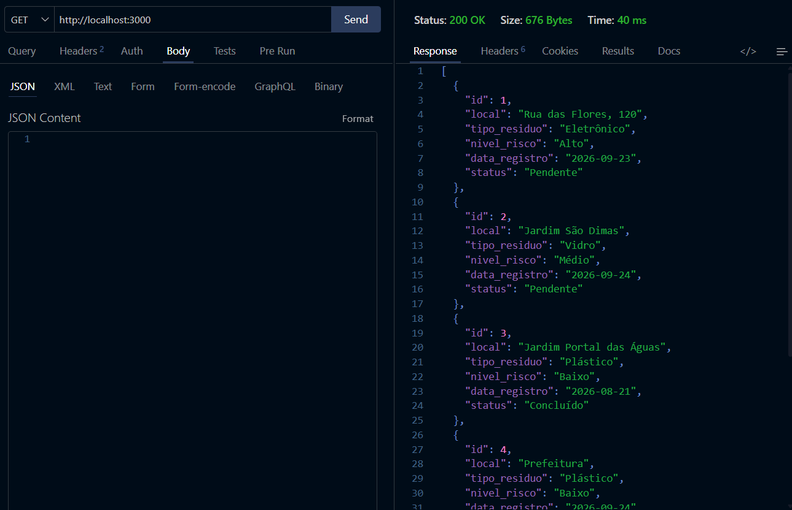
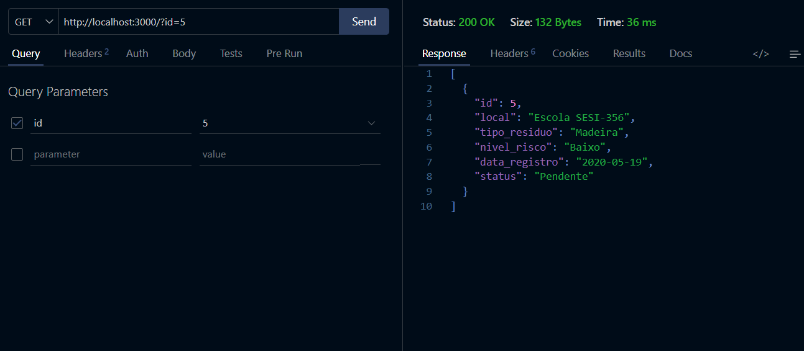
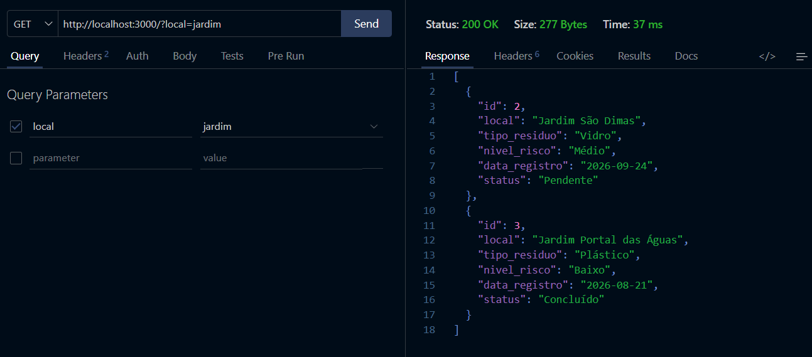
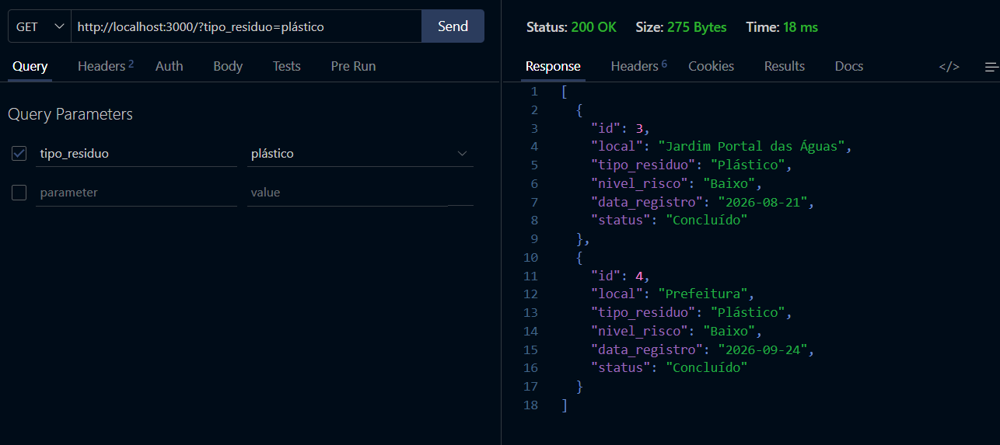
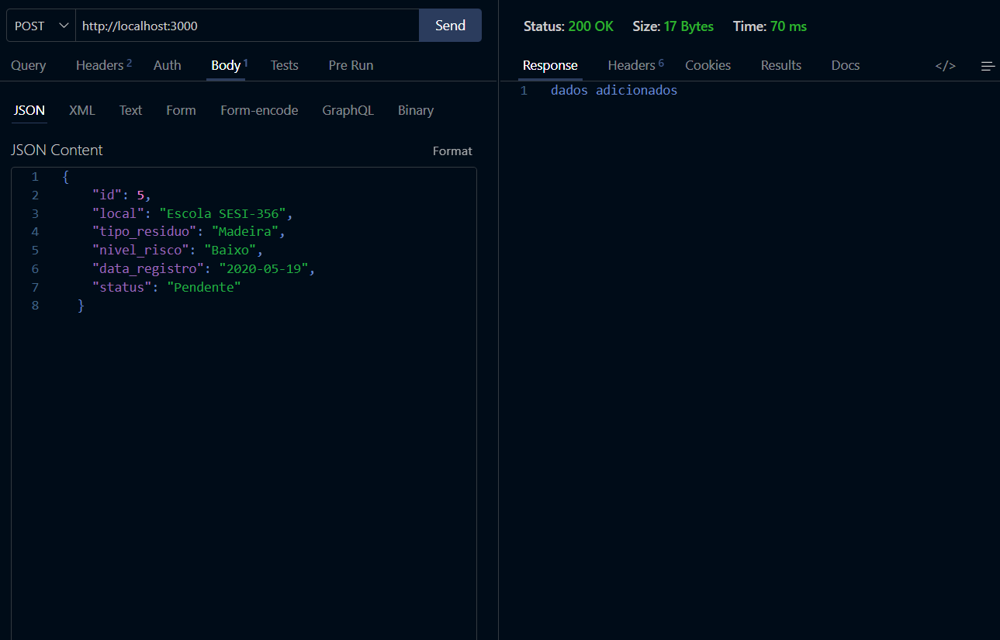
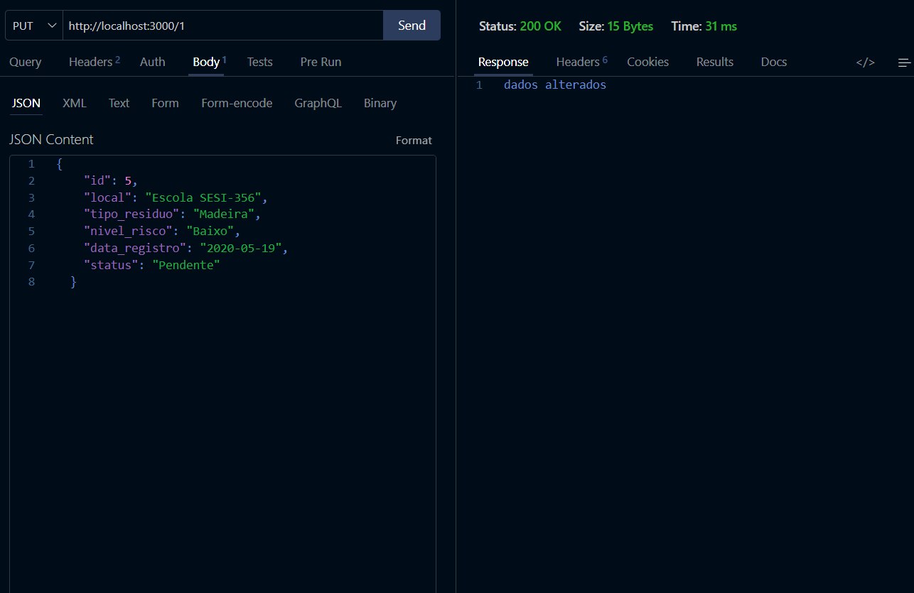
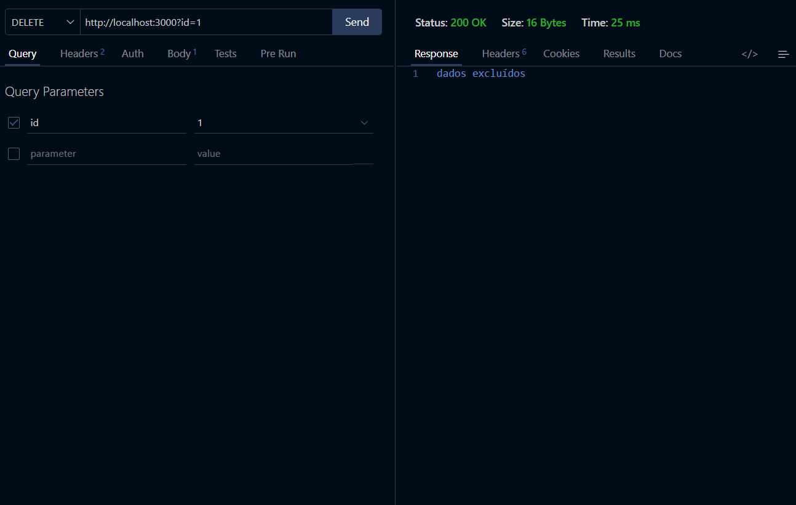
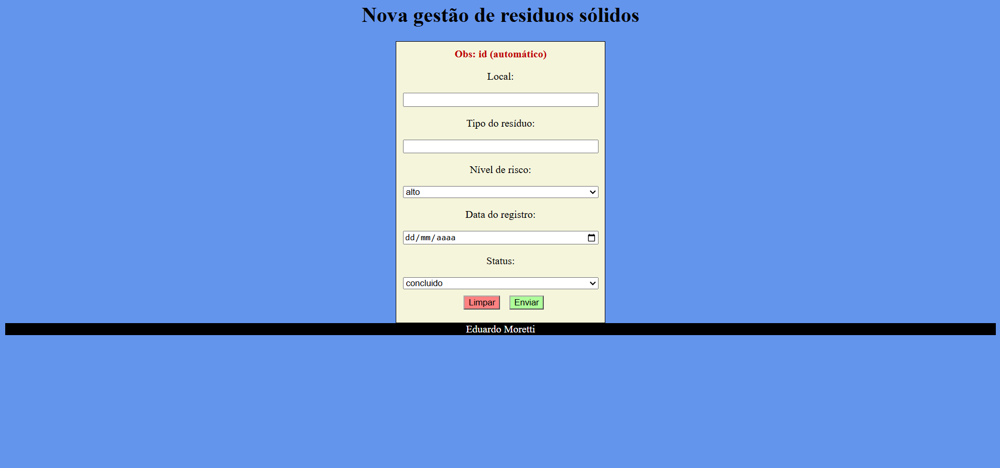
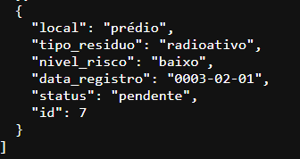

# Gestão de Resíduos Sólidos (vps01 PBE)

## Descrição
A prefeitura de Amparo necessita realzar o Monitoramento de pontos de descarte irregular, para isso desenvolva um sistema para registrar locais onde foram identificados descartes de lixo, entulho ou resíduos eletrônicos.

## Tecnologias
- **Node.sj**
- **JavaScript**
- **VsCode**
- **VsCode** Thunder Client

## Passos para testar
- 1 Clone este repositório
- 2 Abra com **VsCode** e em um terminal digite:
```bash
npm install
npm run dev
```
- 3 Teste as rotas com a extensão `Thunder Client` do **VsCode**
- 4 Abra o arquivo client/index.html com a extensão `Live Server` do **VsCode**

## Print dos testes e exemplo de requisições

- Mostrar


- Buscar por id


- Buscar por local


- Buscar por tipo


- Adicionar


- Alterar


- Excluir


---

## Cliente


- Resposta:


